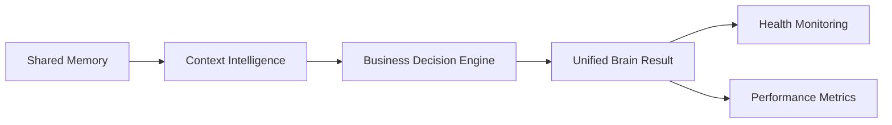
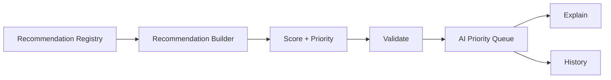
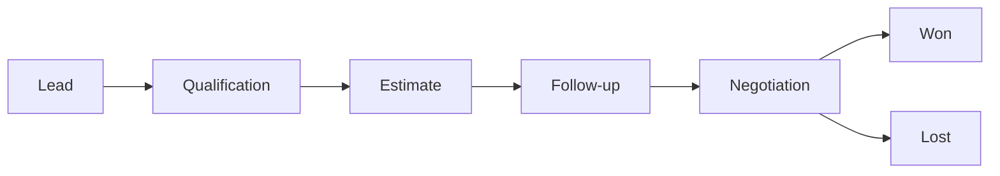
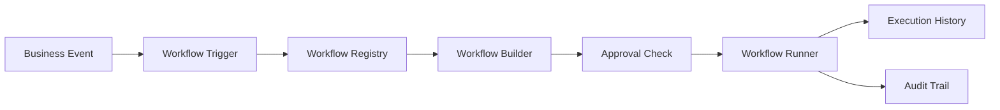

# CompHelp AI Architecture Bible v1.0

CompHelp AI is an AI Business Operating System for service businesses. The first business vertical is local technology services: computer repair, security camera installation, networking, smart home setup, and data recovery.

## Vision

Mission: help service businesses operate with the speed, memory, and consistency of an AI-powered back office while keeping humans in control of customer trust, payments, dispatch, and publishing.

Product philosophy:

- Start with real daily workflows: leads, estimates, vendors, projects, follow-ups, gallery updates, and reporting.
- Keep every automation approval-aware by default.
- Prefer small composable agents over one giant assistant.
- Support JSON fallback locally and Supabase in production.
- Preserve customer privacy and business reputation before growth automation.

Long-term goal: become a multi-tenant SaaS platform where service businesses can run sales, operations, marketing, dispatch, finance, content, and customer support from one agent-assisted dashboard.

SaaS strategy: begin as an internal operating system for CompHelp AI, prove workflows in Los Angeles service operations, then generalize the database, roles, agent mesh, and industry templates for other service companies.

## System Architecture

Frontend:

- Static HTML service pages and local SEO pages.
- `marketplace.html` as the admin operating dashboard.
- `assets/marketplace-manager.js` as the browser controller for dashboard modules.
- Service pages remain fast, dark themed, SEO optimized, and independent of heavy client frameworks.

Backend:

- Vercel serverless API routes in `api/`.
- Node.js scripts and agents in `agents/` and `scripts/`.
- APIs return safe JSON and avoid exposing secrets.

API layer:

- `/api/marketplace` handles current marketplace dashboard resources.
- `/api/system` is the consolidated System API Router for internal modules.
- `server/api-modules/` preserves internal handlers for developer, business-os, platform, titan, and brain without counting each one as a Vercel Serverless Function.
- Supporting APIs handle quotes, uploads, outreach, estimates, follow-ups, social leads, and vendor dispatch.

API Consolidation Hotfix:

- Vercel Hobby limits projects to 12 Serverless Functions.
- Internal API modules route through `/api/system` using `{ module, action, payload }`.
- The dashboard uses `/api/system` for developer, business-os, platform, titan, and brain calls.
- Legacy code is preserved in `server/api-modules/`.

Database layer:

- `database/` contains the Phase 6.1 abstraction.
- Supabase is used when `SUPABASE_URL` and `SUPABASE_SERVICE_ROLE_KEY` are configured.
- JSON fallback uses `data/marketplace.json` and must never be broken.
- Modules expose `create`, `list`, `getById`, `update`, `remove`, and `search`.
- v0.7 platform modules add users, organizations, roles, permissions, sessions, audit logs, notifications, and preferences while preserving JSON fallback compatibility.

Core platform foundation:

- Organizations are the future tenant boundary.
- Users belong to organizations and receive roles.
- Roles map to permissions.
- Sessions are stored by hashed token values.
- Audit logs record account, permission, session, and workflow events.
- Notifications and preferences provide the base for multi-user dashboard experiences.

AI agent layer:

- Agents live in `agents/`.
- Agents produce drafts, recommendations, reports, and approval queues.
- Agents must not push code, deploy, send customer messages, or publish social posts without approval unless a future explicit policy allows it.

Storage:

- JSON fallback in `data/`.
- Cloudinary is the intended media storage provider for uploaded project media.
- Supabase is the intended system database.
- Local backup ZIPs are created by `scripts/backup-project.js`.

Integrations:

- OpenAI for reasoning, drafting, analysis, and chatbot behavior.
- Supabase for production data.
- Cloudinary for media.
- GitHub for source control automation.
- Vercel for hosting and deployment.
- Twilio, Resend, Vapi, HubSpot, and n8n are optional integration layers.

Deployment:

- Local development runs from the repository.
- GitHub main is the production source branch unless changed later.
- Vercel deploys static pages and serverless APIs.
- Push and deploy require explicit owner approval.

## Core Principles

- Never expose secrets.
- Never commit `.env` or `.env.local`.
- Never delete customer data automatically.
- Never remove working features while extending the system.
- Prefer additive, backward-compatible changes.
- Keep the app deployable after each phase.

## Project Titan

Project Titan is the internal engineering operating system for building CompHelp AI. Titan adds the AI Executive Board, CompHelp AI Score, sprint quality gates, product strategy review, customer feedback loop, and quality review categories for performance, reliability, security, and AI output quality.

Titan is foundation-only until explicitly expanded. It does not scrape competitors, call external APIs, send messages, publish content, push code, or deploy infrastructure.

## Project Control Center

The Project Control Center sits beside Project Titan as the planning and focus layer. It stores the current mission, release, sprint, backlog, decisions, and next actions in Markdown documents and exposes safe internal summaries through `/api/system` module `titan`.

The Control Center does not automate work. It organizes work so future agents and engineers can choose the right next task without losing the long-term vision.

## CompHelp Brain Kernel

The CompHelp Brain Kernel is the internal intelligence layer for every future AI agent. It is not a CRM feature and does not connect to external AI providers in Beta Sprint 1.

Brain modules:

- Context Engine.
- Memory Manager.
- Recommendation Engine.
- Decision Engine.
- Knowledge Registry.
- Executive Summary Engine.

The Brain exposes safe internal architecture through `/api/system` module `brain` and a dashboard section. Memory writes and AI learning are intentionally disabled until a future approved storage and privacy policy exists.

## Shared Memory Engine

Project Titan Beta Sprint 2 adds a local JSON-backed Shared Memory Engine used by future AI modules. It includes short, long, business, customer, session, and knowledge memory providers. Providers expose the same interface: `save`, `load`, `update`, `delete`, `search`, and `clear`.

Memory is local architecture only. It does not connect to external AI, OpenAI, Supabase memory, vector databases, or external APIs.

## Context Intelligence Engine

Project Titan Beta Sprint 3 adds a centralized Context Intelligence Engine. The engine builds one AI-ready context package before recommendations or decisions are made.

Context lifecycle:

1. Register context providers.
2. Resolve customer, organization, session, job, conversation, technician, memory, knowledge, recommendations, preferences, and permissions.
3. Build a unified context package.
4. Validate missing context.
5. Score context quality.
6. Return the package to future AI modules.

Context providers:

- Customer Context.
- Organization Context.
- Session Context.
- Job Context.
- Conversation Context.
- Technician Context.

Future AI integration must use this context package before model calls. No external AI provider is connected in Sprint 3.

## Business Decision Engine

Project Titan Gamma Sprint 4 adds an explainable Business Decision Engine. The engine consumes Context and Memory, applies registered decision templates and business policies, then returns a structured decision model.

Decision flow:

1. Build context package.
2. Load memory statistics and relevant memory scopes.
3. Select registered decision type.
4. Apply decision policies.
5. Build decision object.
6. Score confidence and priority.
7. Validate required fields.
8. Record local decision history.

Decision lifecycle:

- draft.
- evaluated.
- validated.
- owner review.
- handoff to recommendation or workflow.

Policy system:

- High Value Customer.
- VIP Customer.
- Emergency Call.
- Warranty Active.
- Low Inventory.
- Technician Busy.
- Business Hours.
- After Hours.

Explainable decision model: every decision includes `decisionId`, `type`, `recommendedAction`, `confidence`, `priority`, `risk`, `reasoning`, `usedMemory`, `usedContext`, `alternatives`, and `timestamp`.

## Brain Orchestrator

Project Titan Sprint 4.5 adds the Brain Orchestrator as the unifying layer for the existing Memory, Context, and Decision engines. The orchestrator does not replace any engine. It verifies communication, runs the internal pipeline, records lightweight internal events, and returns a single Business Brain result.

Brain pipeline:

1. Memory stats and provider availability.
2. Unified Context package.
3. Explainable Business Decision.
4. Unified Brain result with confidence, recommended action, warnings, and performance metrics.

Module dependencies:

- `brain/orchestrator/brain-pipeline.js` coordinates Memory, Context, and Decision.
- `brain/orchestrator/brain-health.js` reports Brain health, module status, missing dependencies, errors, and warnings.
- `brain/orchestrator/brain-metrics.js` measures memory access time, context build time, decision time, pipeline time, and average response time.
- `brain/orchestrator/brain-events.js` keeps an in-memory internal event log for diagnostics.
- `agents/integration-agent.js` produces integration diagnostics for dashboard and owner review.

Integration flow:

Health monitoring returns Brain Health, Module Status, Pipeline Status, Missing Dependencies, Average Response Time, Errors, and Warnings. No external AI provider, external API, or deployment architecture change is introduced in Sprint 4.5.

## Recommendation Intelligence Engine

Project Titan Sprint 5 adds a Recommendation Intelligence Engine that turns the Business Brain into an explainable AI Advisor. The engine is rule-based in this sprint and does not connect to OpenAI, Anthropic, Gemini, or any external AI provider.

Recommendation lifecycle:

1. Select recommendation templates from the registry.
2. Build recommendations from business context.
3. Estimate revenue and business impact.
4. Score confidence, priority, and business value.
5. Validate the required recommendation model.
6. Rank the AI priority queue.
7. Store recommendation history when recording is enabled.
8. Explain the recommendation before owner action.

Business value model:

- Revenue uses explicit project value when available, then conservative service defaults.
- Business impact is described in plain language such as higher close rate, reduced travel time, stronger cash flow, or improved retention.
- Every customer-facing or vendor-facing action remains approval-only.

Priority model:

- Priority combines urgency, risk, revenue signal, and recommendation type.
- Priority score ranks `CRITICAL`, `HIGH`, `MEDIUM`, and `LOW` recommendations.
- Business value score blends confidence, urgency, and estimated revenue.

Recommendation pipeline:

## Executive Intelligence

Project Titan Epic C Sprint 6 adds Executive Intelligence as the owner-facing business operating layer. It reuses Marketplace JSON data, the Recommendation Engine, and the existing Brain architecture to produce executive dashboards, daily briefings, KPI monitoring, forecasts, risk detection, and growth opportunities.

Executive modules:

- `executive-engine.js` exposes the public Executive Intelligence interface.
- `executive-dashboard.js` builds the owner dashboard payload.
- `executive-briefing.js` creates the daily executive briefing.
- `executive-kpi.js` reads JSON-compatible operating data and calculates KPIs.
- `executive-health.js` creates the 0-100 business health model.
- `executive-risk.js` detects late estimates, late invoices, idle technicians, missed follow-ups, low conversion, churn risk, inventory shortage, and scheduling conflicts.
- `executive-forecast.js` creates revenue, workload, customer growth, marketing, cash flow, and technician capacity forecasts.
- `executive-opportunities.js` surfaces revenue, sales, customer, and marketing opportunities.
- `executive-insights.js` summarizes owner-level insights.
- `executive-summary.js` returns the required executive output format.

Business Health Model:

- Overall Score.
- Revenue.
- Operations.
- Sales.
- Customers.
- Marketing.
- Technicians.
- Finance.
- Inventory.

Forecast Model:

- Revenue forecast.
- Workload forecast.
- Customer growth.
- Marketing performance.
- Cash flow trend.
- Technician capacity.

Risk Model:

- Detects operational, sales, customer, finance, inventory, and scheduling risks using local data and safe defaults.
- Does not automate outreach, dispatch, collections, or publishing.

KPI Engine:

- Calculates revenue today, yesterday, week, and month.
- Tracks open jobs, completed jobs, open estimates, conversion rate, average job value, outstanding invoices, collections, technician utilization, customer satisfaction, marketing performance, and inventory status.

## AI Sales Manager

Project Titan Epic D Sprint 7 adds the first AI Employee focused on revenue growth and sales pipeline discipline. The Sales Manager reuses Marketplace JSON data, Executive KPI utilities, Recommendation Intelligence, and owner-approval safety rules.

Sales pipeline:

Sales modules:

- `sales-engine.js` exposes the Sales Intelligence interface.
- `pipeline-manager.js` maps leads and estimates into pipeline stages.
- `estimate-scoring.js` scores open estimates by value, age, service, status, and probability.
- `deal-priority.js` ranks deals and recommends the next owner action.
- `followup-engine.js` builds today's calls and follow-up queue.
- `sales-dashboard.js` returns the dashboard payload.
- `conversion-engine.js` calculates sales KPIs.
- `customer-intelligence.js` detects VIP customers, churn risks, and the best customer to call.
- `revenue-opportunities.js` detects estimate conversion, upsell, cross-sell, and VIP opportunities.

Sales KPIs:

- Open estimates.
- Won estimates.
- Lost estimates.
- Conversion rate.
- Average deal size.
- Revenue pipeline.
- Follow-up completion.
- Average close time.

All sales outputs are recommendations only. The Sales Manager never contacts customers, sends messages, changes prices, or pushes discounts without owner approval.

## Workflow & Automation Engine

Project Titan Epic D Sprint 7.5 adds the shared workflow layer used by every AI Employee. The workflow engine provides one orchestration system for event-based execution, approvals, task queues, automation rules, retry policies, notifications, execution history, and audit trails.

Supported events:

- New Lead.
- New Estimate.
- Estimate Accepted.
- Invoice Overdue.
- Job Completed.
- Customer Created.
- Technician Assigned.
- Inventory Low.

Workflow lifecycle:

Architecture rules:

- Workflow actions are internal records unless a future approved integration is connected.
- Customer-facing actions default to `needs_approval`.
- The workflow layer reuses Context, Decision, Recommendation, and Executive Intelligence.
- No external AI provider, messaging provider, deployment pipeline, or autonomous execution is connected in Sprint 7.5.

## Operations Center

Project Titan Sprint 9 adds the daily operations dashboard for owners, dispatchers, and technicians. It reuses Executive Intelligence, Recommendation Engine, Workflow Engine, Sales Manager, and JSON-compatible marketplace data.

Operations modules:

- `operations-engine.js` exposes the Operations Center interface.
- `jobs-board.js` builds today's jobs, urgent jobs, open jobs, and at-risk jobs.
- `technician-board.js` summarizes technician/vendor availability and workload.
- `dispatch-suggestions.js` recommends technician matches without auto-assigning.
- `schedule-health.js` scores schedule load, unassigned jobs, and at-risk work.
- `job-priority.js` ranks the job queue.
- `customer-timeline.js` identifies customer waiting issues.
- `inventory-needs.js` flags low or inferred materials.
- `operations-dashboard.js` combines operations data for UI and API consumers.

Operations safety:

- Dispatch suggestions are advisory only.
- Technicians are never assigned automatically.
- Customers are never contacted automatically.
- Inventory needs are prompts for owner/dispatcher review.

## Finance Center

Project Titan Sprint 10 adds the Finance Center for service business owners. It focuses on architecture and UI with JSON/demo fallback data, and it does not connect payment gateways or external financial APIs.

Finance modules:

- `finance-engine.js` exposes the Finance Center interface.
- `finance-dashboard.js` combines finance widgets for the UI.
- `revenue-engine.js` calculates revenue today, week, month, and trend.
- `invoice-engine.js` tracks paid, outstanding, and overdue invoices.
- `cashflow-engine.js` estimates inflow, outflow, and cash flow status.
- `expense-engine.js` groups expenses by category.
- `profit-engine.js` estimates profit and margin.
- `forecast-engine.js` returns monthly and cash flow forecasts.
- `financial-health.js` scores financial health and alerts.
- `financial-kpis.js` provides shared finance calculations and JSON/demo fallback data.

Finance safety:

- No payment gateway is connected.
- No invoices are sent automatically.
- No collections messages are sent automatically.
- Financial recommendations are advisory and owner-reviewed.

## Customer Success Center

Project Titan Sprint 11 adds Customer Success Center for retention, repeat revenue, customer risk detection, VIP identification, and owner-approved follow-up recommendations.

Customer Success modules:

- `customer-success-engine.js` exposes the Customer Success API surface.
- `customer-health.js` scores customer health from 0 to 100.
- `customer-dashboard.js` combines health, VIPs, risks, lost customers, LTV, timeline, repeat revenue, follow-ups, reviews, and recommendations.
- `customer-timeline.js` summarizes lead, estimate, project, invoice, and task activity.
- `customer-ltv.js` creates customer profiles and lifetime value.
- `customer-risk.js` detects at-risk customers.
- `customer-segments.js` counts VIP, at-risk, repeat-ready, estimate follow-up, and unknown segments.
- `vip-customers.js` finds high-value and repeat customers.
- `lost-customers.js` identifies lost or inactive customer signals.
- `customer-recommendations.js` combines customer-specific recommendations with the Recommendation Engine.

Customer Success safety:

- Follow-ups are recommendations only.
- Review requests require owner approval.
- No fake reviews or customer outcomes are generated.
- No external AI or messaging integration is connected.

## Marketing & Growth Center

Project Titan Sprint 12 adds the Marketing & Growth Center for lead source tracking, campaign performance, local SEO health, reputation, social performance, email campaign drafts, marketing ROI, and AI growth recommendations.

Marketing modules:

- `marketing-engine.js` exposes the Marketing & Growth API surface.
- `marketing-dashboard.js` combines marketing widgets for the UI.
- `lead-sources.js` summarizes website, social, referral, and local search lead sources.
- `campaigns.js` tracks campaign spend, leads, revenue, and ROI.
- `local-seo.js` evaluates local SEO coverage and keyword opportunities.
- `reviews-engine.js` summarizes reputation and review needs.
- `social-performance.js` tracks social draft and reach signals.
- `email-campaigns.js` tracks email campaign drafts and lead outcomes.
- `marketing-roi.js` calculates marketing return, cost per lead, and revenue attribution.
- `growth-recommendations.js` combines marketing data with the Recommendation Engine.

Marketing safety:

- No Google, Facebook, Instagram, TikTok, or paid ad APIs are connected.
- Campaign data uses JSON/demo fallback until approved integrations exist.
- Social and email outputs are drafts only.
- Growth recommendations are advisory and owner-reviewed.

## Analytics & Reporting Center

Project Titan Sprint 13 adds the Analytics & Reporting Center for unified reporting across Sales, Operations, Finance, Customer Success, and Marketing.

Analytics modules:

- `analytics-engine.js` exposes the Analytics & Reporting API surface.
- `reporting-dashboard.js` combines scorecards, KPIs, trends, reports, and insights.
- `kpi-summary.js` calculates shared revenue, lead, estimate, job, customer, vendor, and marketing KPIs.
- `trend-analysis.js` summarizes revenue, sales, operations, customer, marketing, and lead trends.
- `performance-reports.js` generates weekly and monthly business report drafts.
- `business-scorecard.js` scores sales, operations, finance, customers, and marketing.
- `export-reports.js` prepares report exports without writing files or connecting paid services.
- `ai-insights-report.js` creates explainable owner-reviewed insights.

Analytics safety:

- Reports use JSON/demo fallback data.
- No external analytics, advertising, or BI services are connected.
- Exports are generated as data objects only.
- Insights are advisory and require owner review before action.

## Scheduling & Dispatch AI

Project Titan Sprint 14 adds Scheduling & Dispatch AI for schedule optimization, technician matching, route suggestions, ETA windows, capacity planning, emergency dispatch visibility, and dispatch decision support.

Dispatch AI modules:

- `dispatch-ai-engine.js` exposes the Dispatch AI API surface.
- `dispatch-dashboard.js` combines schedule, technicians, routes, ETA, capacity, emergency jobs, conflicts, and suggestions.
- `schedule-optimizer.js` orders open jobs by priority and risk.
- `technician-matcher.js` ranks technician matches by service fit, city, service area, rating, and workload.
- `route-planner.js` groups suggested stops by technician.
- `eta-engine.js` creates advisory arrival windows.
- `capacity-planner.js` scores open job load against available technician capacity.
- `emergency-dispatch.js` highlights urgent and same-day jobs for owner review.

Dispatch AI safety:

- No external maps or routing APIs are connected.
- ETA and route suggestions are advisory only.
- Technicians are not assigned automatically.
- Emergency jobs require manual customer confirmation.

## SaaS Multi-Tenant Foundation

Project Titan Sprint 15 adds the SaaS Multi-Tenant Foundation for organizations, teams, tenant context, tenant-scoped roles, permissions, settings, and tenant health.

SaaS modules:

- `tenant-engine.js` exposes the SaaS foundation API surface.
- `organization-manager.js` summarizes tenant organization records.
- `team-manager.js` summarizes users and role distribution.
- `tenant-context.js` builds the current JSON-backed tenant context.
- `tenant-permissions.js` validates roles, permissions, default role coverage, and tenant scope.
- `tenant-settings.js` summarizes tenant settings and recommended future settings.
- `tenant-dashboard.js` combines organizations, teams, roles, permissions, settings, and tenant health.

SaaS safety:

- Sprint 15 uses JSON fallback only.
- Supabase/PostgreSQL is prepared for later but not connected.
- Secrets are never read, logged, or exposed.
- Tenant health is advisory and should be verified before production SaaS onboarding.

## Billing & Subscriptions

Project Titan Sprint 16 adds billing architecture and subscription plan management for future SaaS monetization.

Billing modules:

- `billing-engine.js` exposes the Billing API surface.
- `plans.js` defines draft SaaS plans and billing data normalization.
- `subscriptions.js` summarizes tenant subscription status.
- `invoices.js` summarizes billing invoices without processing payments.
- `usage-tracking.js` prepares usage metering for future plan limits.
- `billing-dashboard.js` combines plans, subscriptions, usage, invoices, payment status, and upgrade recommendations.
- `payment-status.js` confirms payment-provider safety state.

Billing safety:

- Stripe is not connected.
- No real payment processing exists.
- Card data is never stored.
- Billing outputs are architecture and planning data until a future approved payment sprint.

## Public API & Integrations Foundation

Project Titan Sprint 17 adds public API architecture and an integration framework for future third-party connections.

Integrations modules:

- `integration-engine.js` exposes the Integrations API surface.
- `public-api-registry.js` defines planned public API endpoints and connected app placeholders.
- `api-key-manager.js` tracks API key metadata without storing or exposing real secrets.
- `webhook-manager.js` tracks webhook definitions with delivery disabled.
- `integration-logs.js` summarizes sanitized integration logs.
- `integration-dashboard.js` combines registry, API keys, webhooks, connected apps, logs, and developer notes.

Integrations safety:

- External APIs are not connected.
- API keys are metadata only and masked in UI/API outputs.
- Webhook delivery is disabled until signing, retries, and tenant isolation are approved.
- Public API endpoints must enforce authentication, rate limits, and tenant isolation before production use.

## V1.0 Release Candidate Layer

Project Titan Sprint 20 adds a release-candidate layer for product readiness review, not new business functionality.

Release modules:

- `release-manager.js` exposes release status helpers.
- `release-validator.js` checks navigation consistency, required docs, focused tests, and API function count.
- `release-report.js` combines architecture, performance, security, UI, documentation, score, and readiness review.
- `system-health.js` checks critical files, installed modules, API count, and test count.
- `version-manager.js` records the V1 release candidate version and history.
- `quality-score.js` calculates overall product, performance, security, docs, accessibility, API, and test scores.
- `performance-review.js` surfaces large-file and dashboard-size considerations.

Release safety:

- Release Center is review-only.
- No external services, authentication, database, payment gateway, or integrations are added.
- Commit, push, and deploy still require explicit owner approval.

## Database Foundation Layer

Project Titan Sprint 21 adds a SaaS-ready database foundation while keeping JSON fallback as the safe default.

Database modules:

- `database/core/` provides configuration, health, validation, migration readiness, seed readiness, errors, and a client wrapper.
- `database/schema/` defines declarative table models and validation rules.
- `database/repositories/` exposes consistent CRUD, search, pagination, and validation interfaces.
- `database/sql/` stores review-only PostgreSQL/Supabase migration drafts.
- `supabase/` stores readiness placeholders for client configuration, auth, storage, and RLS policy examples.
- `agents/database-agent.js` reports schema, repository, migration, seed, and Supabase readiness.

Database safety:

- JSON fallback remains active.
- No production Supabase project is connected.
- SQL files are not executed automatically.
- RLS policies are examples only.
- Real credentials must never be committed.

## Identity & Authentication Platform

Phase 2 Epic 1 adds an enterprise-ready identity architecture without connecting a real authentication provider.

Identity modules:

- `identity/` defines readiness, validation, health, audit, roles, permissions, session model, and login flow.
- `auth/` defines login, logout, registration, refresh-token, password reset, session, token, and JWT placeholder modules.
- `organizations/` defines organization validation, tenant boundary model, and organization status.
- `roles/` defines permissions, role-permission mapping, and RBAC decisions.
- `users/` defines user profile, settings, preferences, and activity models.
- `agents/identity-agent.js` provides authentication readiness and security diagnostics.

Identity safety:

- Supabase Auth is not connected.
- OAuth providers are not connected.
- Passwords are not stored.
- Signed tokens are not issued.
- Demo mode and JSON fallback remain compatible.

## Real Customer CRM

Project Titan Epic 2 adds a working customer management layer backed by JSON fallback storage.

CRM capabilities:

- Customer create, edit, soft delete, archive, restore, search, profile, recent customer, and dashboard actions.
- Customer notes with internal and pinned note support.
- Customer timeline built from customer events, estimates, jobs, invoices, payments, and notes.
- Customer summary with last contact, open jobs, invoice count, outstanding balance placeholder, and recommended next action.
- Marketplace Manager Customer CRM UI for list, details, timeline, notes, search, and filters.

CRM safety:

- Production database is not connected.
- JSON fallback remains active.
- Delete uses soft delete.
- Archive and restore preserve customer history.

## Real Job Dispatch & Scheduling

Project Titan Epic 3 adds a working dispatch workflow backed by JSON fallback storage.

Dispatch capabilities:

- Job create, update, assign, reassign, remove assignment, schedule, status update, complete, details, dashboard, timeline, and AI dispatch actions.
- Scheduling conflict detection prevents double-booking the same technician.
- Completion generates a draft invoice placeholder and an AI recommendation event.
- Marketplace Manager Job Dispatch UI provides jobs dashboard, dispatch board, technician assignment, status timeline, and schedule view.

Dispatch safety:

- Production database is not connected.
- JSON fallback remains active.
- Invoice generation is placeholder-only.
- AI Dispatch is rules-based and does not connect external AI or maps.

## Real Revenue Flow

Project Titan Epic 4 adds a JSON-backed money flow for service businesses.

Revenue capabilities:

- Estimate creation, editing, approval, rejection, and conversion to jobs.
- Estimate line items for labor, materials, discount, tax placeholder, and total.
- Invoice creation, editing, sent/paid/overdue status, partial payment placeholder, and outstanding balance.
- Manual payment status records without card data or payment processor integration.
- Customer financial history with estimates, invoices, payments, outstanding balance, and lifetime revenue.
- Revenue dashboard and rules-based AI revenue recommendations.

Revenue safety:

- Real payment processors are not connected.
- Card data is never stored.
- Production database is not connected.
- Tax and invoice delivery remain placeholders.
