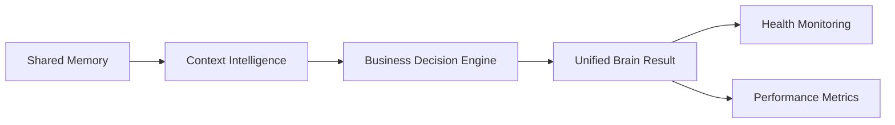

# CompHelp AI Architecture Bible v1.0

CompHelp AI is an AI Business Operating System for service businesses. The first business vertical is local technology services: computer repair, security camera installation, networking, smart home setup, and data recovery.

## Vision

Mission: help service businesses operate with the speed, memory, and consistency of an AI-powered back office while keeping humans in control of customer trust, payments, dispatch, and publishing.

Product philosophy:

- Start with real daily workflows: leads, estimates, vendors, projects, follow-ups, gallery updates, and reporting.
- Keep every automation approval-aware by default.
- Prefer small composable agents over one giant assistant.
- Support JSON fallback locally and Supabase in production.
- Preserve customer privacy and business reputation before growth automation.

Long-term goal: become a multi-tenant SaaS platform where service businesses can run sales, operations, marketing, dispatch, finance, content, and customer support from one agent-assisted dashboard.

SaaS strategy: begin as an internal operating system for CompHelp AI, prove workflows in Los Angeles service operations, then generalize the database, roles, agent mesh, and industry templates for other service companies.

## System Architecture

Frontend:

- Static HTML service pages and local SEO pages.
- `marketplace.html` as the admin operating dashboard.
- `assets/marketplace-manager.js` as the browser controller for dashboard modules.
- Service pages remain fast, dark themed, SEO optimized, and independent of heavy client frameworks.

Backend:

- Vercel serverless API routes in `api/`.
- Node.js scripts and agents in `agents/` and `scripts/`.
- APIs return safe JSON and avoid exposing secrets.

API layer:

- `/api/marketplace` handles current marketplace dashboard resources.
- `/api/system` is the consolidated System API Router for internal modules.
- `server/api-modules/` preserves internal handlers for developer, business-os, platform, titan, and brain without counting each one as a Vercel Serverless Function.
- Supporting APIs handle quotes, uploads, outreach, estimates, follow-ups, social leads, and vendor dispatch.

API Consolidation Hotfix:

- Vercel Hobby limits projects to 12 Serverless Functions.
- Internal API modules route through `/api/system` using `{ module, action, payload }`.
- The dashboard uses `/api/system` for developer, business-os, platform, titan, and brain calls.
- Legacy code is preserved in `server/api-modules/`.

Database layer:

- `database/` contains the Phase 6.1 abstraction.
- Supabase is used when `SUPABASE_URL` and `SUPABASE_SERVICE_ROLE_KEY` are configured.
- JSON fallback uses `data/marketplace.json` and must never be broken.
- Modules expose `create`, `list`, `getById`, `update`, `remove`, and `search`.
- v0.7 platform modules add users, organizations, roles, permissions, sessions, audit logs, notifications, and preferences while preserving JSON fallback compatibility.

Core platform foundation:

- Organizations are the future tenant boundary.
- Users belong to organizations and receive roles.
- Roles map to permissions.
- Sessions are stored by hashed token values.
- Audit logs record account, permission, session, and workflow events.
- Notifications and preferences provide the base for multi-user dashboard experiences.

AI agent layer:

- Agents live in `agents/`.
- Agents produce drafts, recommendations, reports, and approval queues.
- Agents must not push code, deploy, send customer messages, or publish social posts without approval unless a future explicit policy allows it.

Storage:

- JSON fallback in `data/`.
- Cloudinary is the intended media storage provider for uploaded project media.
- Supabase is the intended system database.
- Local backup ZIPs are created by `scripts/backup-project.js`.

Integrations:

- OpenAI for reasoning, drafting, analysis, and chatbot behavior.
- Supabase for production data.
- Cloudinary for media.
- GitHub for source control automation.
- Vercel for hosting and deployment.
- Twilio, Resend, Vapi, HubSpot, and n8n are optional integration layers.

Deployment:

- Local development runs from the repository.
- GitHub main is the production source branch unless changed later.
- Vercel deploys static pages and serverless APIs.
- Push and deploy require explicit owner approval.

## Core Principles

- Never expose secrets.
- Never commit `.env` or `.env.local`.
- Never delete customer data automatically.
- Never remove working features while extending the system.
- Prefer additive, backward-compatible changes.
- Keep the app deployable after each phase.

## Project Titan

Project Titan is the internal engineering operating system for building CompHelp AI. Titan adds the AI Executive Board, CompHelp AI Score, sprint quality gates, product strategy review, customer feedback loop, and quality review categories for performance, reliability, security, and AI output quality.

Titan is foundation-only until explicitly expanded. It does not scrape competitors, call external APIs, send messages, publish content, push code, or deploy infrastructure.

## Project Control Center

The Project Control Center sits beside Project Titan as the planning and focus layer. It stores the current mission, release, sprint, backlog, decisions, and next actions in Markdown documents and exposes safe internal summaries through `/api/system` module `titan`.

The Control Center does not automate work. It organizes work so future agents and engineers can choose the right next task without losing the long-term vision.

## CompHelp Brain Kernel

The CompHelp Brain Kernel is the internal intelligence layer for every future AI agent. It is not a CRM feature and does not connect to external AI providers in Beta Sprint 1.

Brain modules:

- Context Engine.
- Memory Manager.
- Recommendation Engine.
- Decision Engine.
- Knowledge Registry.
- Executive Summary Engine.

The Brain exposes safe internal architecture through `/api/system` module `brain` and a dashboard section. Memory writes and AI learning are intentionally disabled until a future approved storage and privacy policy exists.

## Shared Memory Engine

Project Titan Beta Sprint 2 adds a local JSON-backed Shared Memory Engine used by future AI modules. It includes short, long, business, customer, session, and knowledge memory providers. Providers expose the same interface: `save`, `load`, `update`, `delete`, `search`, and `clear`.

Memory is local architecture only. It does not connect to external AI, OpenAI, Supabase memory, vector databases, or external APIs.

## Context Intelligence Engine

Project Titan Beta Sprint 3 adds a centralized Context Intelligence Engine. The engine builds one AI-ready context package before recommendations or decisions are made.

Context lifecycle:

1. Register context providers.
2. Resolve customer, organization, session, job, conversation, technician, memory, knowledge, recommendations, preferences, and permissions.
3. Build a unified context package.
4. Validate missing context.
5. Score context quality.
6. Return the package to future AI modules.

Context providers:

- Customer Context.
- Organization Context.
- Session Context.
- Job Context.
- Conversation Context.
- Technician Context.

Future AI integration must use this context package before model calls. No external AI provider is connected in Sprint 3.

## Business Decision Engine

Project Titan Gamma Sprint 4 adds an explainable Business Decision Engine. The engine consumes Context and Memory, applies registered decision templates and business policies, then returns a structured decision model.

Decision flow:

1. Build context package.
2. Load memory statistics and relevant memory scopes.
3. Select registered decision type.
4. Apply decision policies.
5. Build decision object.
6. Score confidence and priority.
7. Validate required fields.
8. Record local decision history.

Decision lifecycle:

- draft.
- evaluated.
- validated.
- owner review.
- handoff to recommendation or workflow.

Policy system:

- High Value Customer.
- VIP Customer.
- Emergency Call.
- Warranty Active.
- Low Inventory.
- Technician Busy.
- Business Hours.
- After Hours.

Explainable decision model: every decision includes `decisionId`, `type`, `recommendedAction`, `confidence`, `priority`, `risk`, `reasoning`, `usedMemory`, `usedContext`, `alternatives`, and `timestamp`.

## Brain Orchestrator

Project Titan Sprint 4.5 adds the Brain Orchestrator as the unifying layer for the existing Memory, Context, and Decision engines. The orchestrator does not replace any engine. It verifies communication, runs the internal pipeline, records lightweight internal events, and returns a single Business Brain result.

Brain pipeline:

1. Memory stats and provider availability.
2. Unified Context package.
3. Explainable Business Decision.
4. Unified Brain result with confidence, recommended action, warnings, and performance metrics.

Module dependencies:

- `brain/orchestrator/brain-pipeline.js` coordinates Memory, Context, and Decision.
- `brain/orchestrator/brain-health.js` reports Brain health, module status, missing dependencies, errors, and warnings.
- `brain/orchestrator/brain-metrics.js` measures memory access time, context build time, decision time, pipeline time, and average response time.
- `brain/orchestrator/brain-events.js` keeps an in-memory internal event log for diagnostics.
- `agents/integration-agent.js` produces integration diagnostics for dashboard and owner review.

Integration flow:

Health monitoring returns Brain Health, Module Status, Pipeline Status, Missing Dependencies, Average Response Time, Errors, and Warnings. No external AI provider, external API, or deployment architecture change is introduced in Sprint 4.5.
