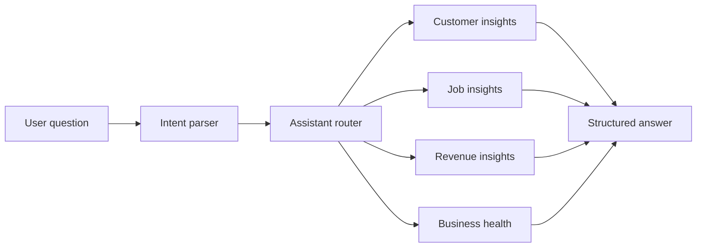

# AI Operations Assistant Architecture

The AI Operations Assistant is implemented as a local business intelligence layer.

## Module

`ai-operations-assistant/assistant.js`

Exports:

- `createAiOperationsAssistant(options)`
- `aiOperationsAssistant`
- `parseIntent(question)`

## Flow

## System API

The assistant is exposed through the consolidated system router:

- `assistant.ask`
- `assistant.summary`
- `assistant.dashboard`
- `assistant.recommendations`
- `assistant.businessHealth`
- `assistant.customerInsights`
- `assistant.jobInsights`
- `assistant.revenueInsights`

## Design Rules

- Reuse JSON fallback.
- Do not connect external AI providers.
- Do not send messages or make changes automatically.
- Return structured responses that the UI can render safely.
- Keep recommendations explainable and action-oriented.

## Future Integration

Future sprints can connect an LLM behind the same intent and insight interfaces. The current assistant remains the deterministic fallback when external AI is unavailable.

