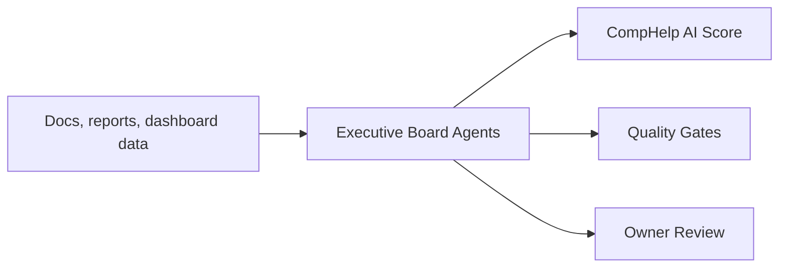

# AI Executive Board

The AI Executive Board is an internal review layer for CompHelp AI. It does not execute external actions. It produces structured recommendations for owner review.

## Board Members

- AI Strategy Agent.
- AI Product Agent.
- AI Customer Success Agent.
- AI Performance Agent.
- AI Reliability Agent.
- AI Security Agent.
- AI QA Agent.
- AI Innovation Agent.

## Operating Model

## Escalation

Escalate to the owner for pricing, public claims, outreach, publishing, deployment, secret exposure, customer privacy, and any irreversible change.

