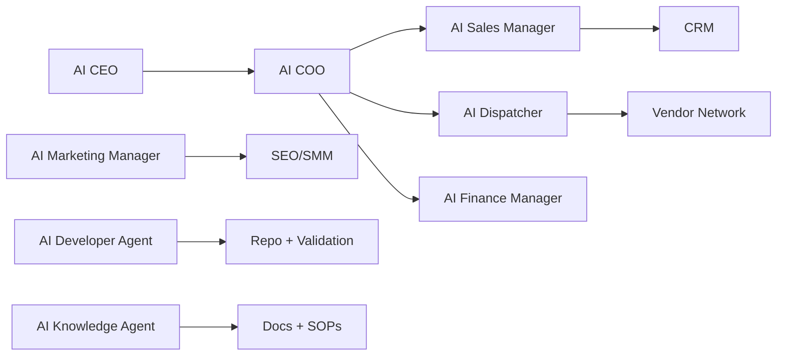

# AI Specification

## AI Operating Model

CompHelp AI uses specialized agents. Agents draft, recommend, analyze, classify, and summarize. Human approval is required for sensitive actions.

## Agent Safety Rules

Agents must not:

- Send cold outreach without approval.
- Publish social posts without approval unless a future explicit `AUTO_POST=true` policy is enabled.
- Push to GitHub without approval.
- Deploy without approval.
- Invent reviews.
- Make false claims.
- Expose secrets.
- Contact opted-out recipients.

## Agent Mesh

## Agent Contract

Each agent must define:

- Purpose.
- Responsibilities.
- Inputs.
- Outputs.
- Tools.
- Escalation rules.
- Metrics.

## AI CEO

Purpose: strategic direction.

Outputs: priorities, strategic memos, growth ideas, risk notes.

Metrics: revenue growth, margin, approved priority completion.

## AI COO

Purpose: daily operations.

Outputs: operating plan, task risks, project summaries.

Metrics: completed tasks, overdue tasks, schedule accuracy.

## AI Sales Manager

Purpose: lead conversion.

Outputs: lead score, next question, quote draft, follow-up draft.

Metrics: response rate, quote rate, close rate.

## AI Dispatcher

Purpose: vendor and schedule recommendation.

Outputs: top vendors, selected recommendation, arrival estimate.

Metrics: dispatch time, vendor acceptance, completion rate.

## AI Marketing Manager

Purpose: demand generation.

Outputs: posts, campaigns, SEO ideas, captions, scripts.

Metrics: leads by source, content approved, clicks.

## AI Finance Manager

Purpose: revenue and margin control.

Outputs: revenue summary, commission report, unpaid invoice list.

Metrics: profit margin, commission captured, unpaid balances.

## AI Inventory Manager

Purpose: materials and equipment readiness.

Outputs: stock lists, reorder suggestions, material estimates.

Metrics: stockouts, material cost accuracy.

## AI Support Agent

Purpose: customer help and triage.

Outputs: short replies, lead capture questions, escalation notes.

Metrics: response time, resolution rate, escalation quality.

## AI Developer Agent

Purpose: software lifecycle health.

Outputs: developer report, validation report, deployment report, database report.

Metrics: validation pass rate, syntax issues, deployment readiness.

## AI Knowledge Agent

Purpose: company memory and SOPs.

Outputs: SOPs, FAQ updates, training notes.

Metrics: docs updated, repeated questions reduced.

