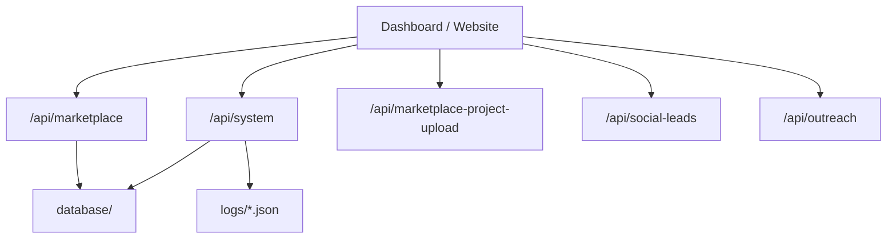

# API Specification

## Principles

- APIs are Vercel serverless routes in `api/`.
- Every route must return JSON.
- Routes must not expose secrets.
- Write actions require server-side role checks.
- Integration failures should return safe errors or fall back where designed.

## Standard Response

Success:

```json
{ "ok": true, "data": {} }
```

Failure:

```json
{ "ok": false, "error": "safe_error_message" }
```

## Route Map



## System API Router

Internal dashboard modules use one Vercel function for Hobby compatibility:

```http
POST /api/system
```

Request body:

```json
{
  "module": "brain",
  "action": "brainStatus",
  "payload": {}
}
```

Supported modules:

- `developer`
- `business-os`
- `platform`
- `titan`
- `brain`

The original module handlers are preserved in `server/api-modules/` so code is not lost while Vercel function count stays below the Hobby limit.

## Core Routes

### `/api/marketplace`

Purpose: current marketplace dashboard API.

Expected actions: login, dashboard resources, leads, vendors, estimates, quotes, commissions, marketing, SMM, SEO, projects, and recommendations.

Safety: must fall back to JSON storage when Supabase is unavailable.

### System module `business-os`

Purpose: Phase 6 business operating system API.

Actions:

- `dashboard`
- `crm`
- `estimate`
- `dispatch`
- `analytics`
- `reports`
- `databaseHealth`

### System module `developer`

Purpose: Developer Center API.

Actions:

- `gitStatus`
- `analyze`
- `validate`
- `deployment`
- `databaseStatus`
- `fullReport`

### System module `platform`

Purpose: v0.7 core platform foundation API for organizations, users, roles, permissions, sessions, audit logs, notifications, and preferences.

### System module `brain`

Purpose: CompHelp Brain Kernel status, health, recommendation, executive summary, memory status, and knowledge status.

### System module `titan`

Purpose: Project Titan and Project Control Center reports.

Actions:

- `platformStatus`
- `ensureDefaults`
- `createOrganization`
- `createUser`
- `createSession`
- `revokeSession`
- `createNotification`
- `updatePreference`
- `audit`

### `/api/social-leads`

Purpose: social lead records and outreach drafts.

Rule: no auto-DM. Owner approval is required.

### `/api/outreach`

Purpose: outreach queue and compliance controls.

Rules: rate limits, opt-out checks, approval queue, pause switch.

### `/api/estimate`

Purpose: estimate generation API for service, city, job size, labor, materials, urgency, and notes.

### `/api/vendor-dispatch`

Purpose: vendor quote draft and dispatch recommendation flow.

### `/api/marketplace-project-upload`

Purpose: project media and gallery upload workflow.

Rule: do not rely only on Vercel temporary filesystem for production media.

## Authentication Headers

Internal dashboard routes currently use:

```text
x-marketplace-admin-secret
```

Future SaaS routes should use session tokens and tenant-scoped permissions.

## Error Handling

API handlers must:

- Wrap code in `try/catch`.
- Use `Content-Type: application/json; charset=utf-8`.
- Use `Cache-Control: no-store` for admin APIs.
- Log safe server-side errors.
- Never return raw secrets or private stack traces.
