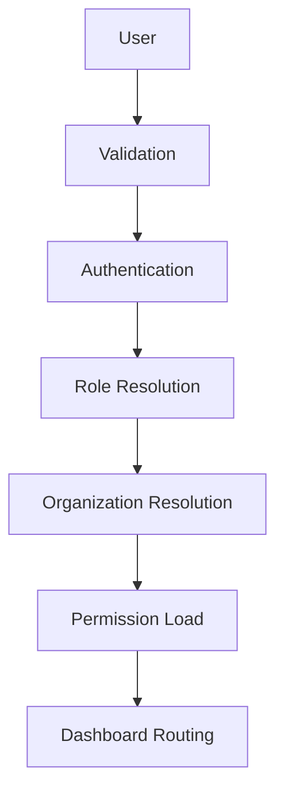

# Authentication Architecture

CompHelp AI Phase 2 Epic 1 prepares authentication architecture without connecting a real provider.

## Principles

- Preserve demo mode.
- Keep JSON fallback compatible.
- Do not store passwords.
- Do not issue signed JWTs yet.
- Do not connect Supabase Auth or OAuth providers yet.
- Route all status checks through `/api/system`.

## Login Flow

## Modules

- `identity/`: readiness, validation, health, and audit architecture.
- `auth/`: login, logout, register, refresh-token, password reset, session manager, token placeholder.
- `organizations/`: organization model, validation, and isolation readiness.
- `roles/`: roles, permissions, and RBAC decisions.
- `users/`: profile, settings, preferences, and activity models.
- `agents/identity-agent.js`: identity readiness diagnostics.

## API Actions

- `identity.status`
- `identity.health`
- `auth.status`
- `session.status`
- `organization.status`
- `roles.status`

## Current State

Authentication is architecture-ready only. Real credential validation, token signing, OAuth, and Supabase Auth are reserved for an approved future sprint.
