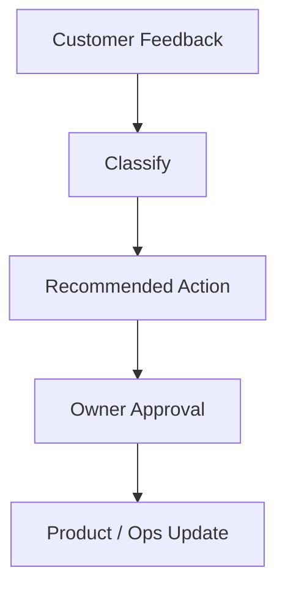

# Customer Feedback Loop

The customer feedback loop turns service experience into product and operations improvements.

## Feedback Sources

- Lead forms.
- Chat messages.
- Phone call summaries.
- Project notes.
- Reviews.
- Follow-up responses.
- Support requests.

## Workflow

## Rules

- Do not send automatic review requests without approval.
- Escalate negative reviews.
- Escalate privacy concerns.
- Summarize patterns before changing roadmap priorities.

