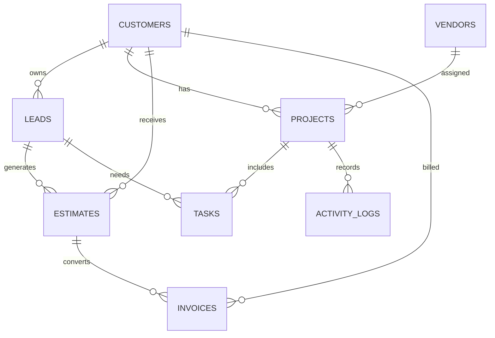

# Database Specification

## Strategy

The database layer supports Supabase and JSON fallback. Supabase is the production target. JSON fallback is required for local development and resilience.

## Current Files

- `database/client.js`: Supabase REST client.
- `database/json-store.js`: JSON fallback store.
- `database/index.js`: database facade.
- Entity modules: leads, vendors, projects, estimates, customers, tasks, activity, settings.
- Platform modules: users, organizations, roles, permissions, sessions, audit logs, notifications, preferences.

## Standard Methods

Every entity module must support:

- `create`
- `list`
- `getById`
- `update`
- `remove`
- `search`

## Response Format

```json
{ "ok": true, "data": [] }
```

or:

```json
{ "ok": false, "error": "message" }
```

## Entity Model



## Core Tables

- customers.
- leads.
- vendors.
- projects.
- estimates.
- invoices.
- tasks.
- activity logs.
- users.
- roles.
- permissions.
- audit logs.
- messages.
- marketing campaigns.
- inventory.

## Soft Delete

Use `deleted_at` in Supabase and `deleted_at` or `deletedAt` in JSON fallback. Read operations must exclude soft-deleted records.

## Multi-Tenant Requirements

All SaaS tables must include `tenant_id`. Production policies must prevent cross-tenant data access.

## Audit Requirements

Audit logs should track authentication, authorization, estimate approvals, dispatch decisions, message sends, payment changes, data exports, and deployment events.

## Data Safety

Do not overwrite `data/marketplace.json`. Migration scripts must create backups before changing persisted data.
