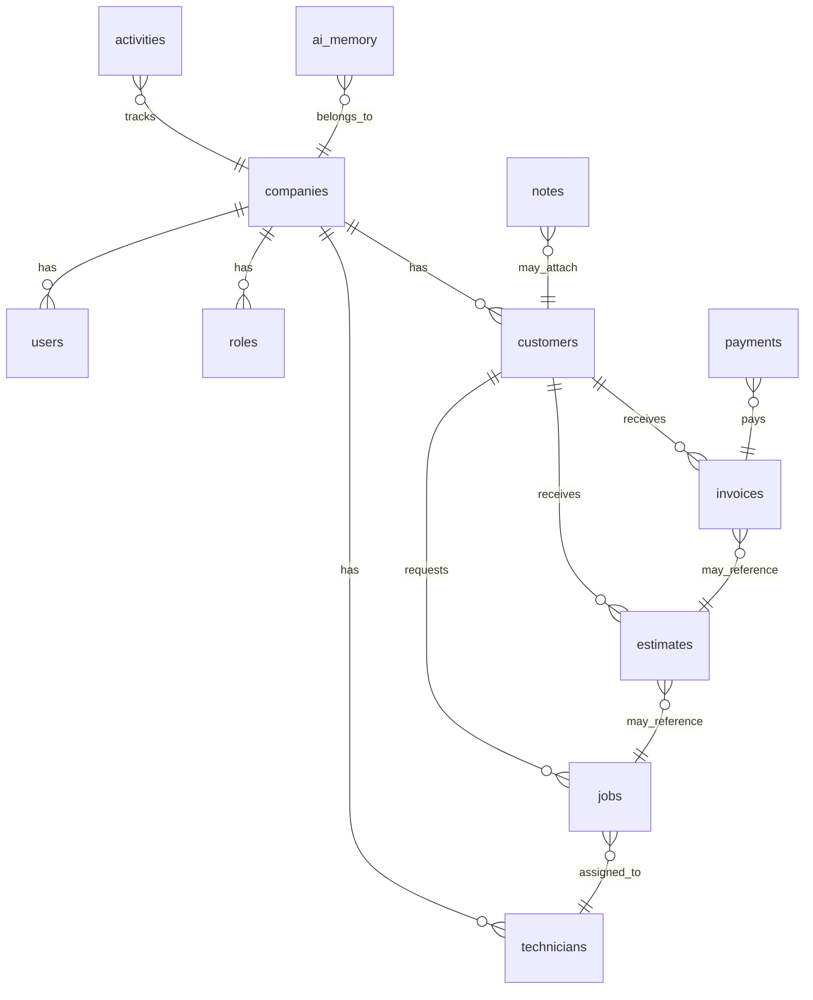

# Data Model

The Sprint 21 data model supports service businesses moving toward SaaS multi-tenancy.

## Required Base Fields

Every major table includes:

- `id`
- `organization_id`
- `created_at`
- `updated_at`
- `created_by`
- `updated_by`
- `status`
- `metadata`

Soft delete uses `deleted_at`.

## Core Tables

- `companies`
- `users`
- `roles`
- `permissions`
- `customers`
- `technicians`
- `jobs`
- `estimates`
- `invoices`
- `payments`
- `tasks`
- `notes`
- `activities`
- `files`
- `inventory`
- `ai_memory`

## Relationships

## Tenant Isolation

Repositories validate `organization_id` for organization-scoped records. Future Supabase RLS policies must enforce the same boundary at the database level.
