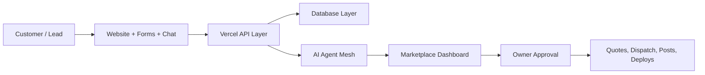

# CompHelp AI Master Specification v1.0

This is the primary reference for future CompHelp AI development. It defines the product, architecture, operating modules, safety rules, workflow standards, and roadmap.

## 1. Executive Summary

CompHelp AI is an AI Business Operating System for service businesses. It combines lead capture, CRM, estimates, dispatch, vendor management, marketplace commissions, project management, media galleries, social media drafts, SEO planning, analytics, and developer operations in one approval-aware platform.

The first operating business is local technology service: security cameras, computer repair, WiFi and networking, smart home setup, and data recovery. The long-term product is a multi-tenant SaaS platform for service industries.

## 2. Product Vision

CompHelp AI should let a small service business operate with the systems discipline of a larger company while preserving human trust. AI agents draft, analyze, recommend, and organize. Owners approve high-impact actions such as outreach, publishing, dispatch, deployment, and money decisions.

## 3. Mission

Help service businesses respond faster, estimate better, dispatch smarter, market consistently, and keep clean operational records.

## 4. Target Industries

Initial industries:

- Computer repair.
- Security camera installation.
- WiFi and network installation.
- Smart home setup.
- Data recovery.

Expansion industries:

- HVAC.
- Plumbing.
- Electrical.
- Cleaning.
- Roofing.
- Property management.
- Appliance repair.
- Handyman services.

## 5. System Overview



## 6. Architecture Overview

Frontend: static HTML pages, service pages, SEO pages, and `marketplace.html`.

Backend: Vercel serverless routes in `api/`.

Database: Supabase when configured, JSON fallback in `data/marketplace.json`.

AI agents: Node.js modules in `agents/`.

Automation: validation, backup, GitHub, and Vercel scripts in `scripts/`.

## 7. Module List

- Public website.
- Lead capture.
- Chat assistant.
- Marketplace dashboard.
- CRM.
- Estimate manager.
- Vendor manager.
- Dispatcher.
- Commission tracking.
- Project manager.
- Gallery manager.
- Social lead finder.
- Follow-up queue.
- SMM manager.
- SEO manager.
- Developer Center.
- Business dashboard.
- Deployment automation.

## 8. AI Agent Mesh

Agents:

- AI CEO: strategy, priorities, business direction.
- AI COO: operations, tasks, daily execution.
- AI Sales Manager: lead qualification and quote flow.
- AI Dispatcher: vendor selection and schedule planning.
- AI Marketing Manager: content, SEO, campaigns.
- AI Finance Manager: revenue, costs, commissions, invoices.
- AI Inventory Manager: equipment and materials planning.
- AI Support Agent: customer questions and support triage.
- AI Developer Agent: validation, reports, git/deploy readiness.
- AI Knowledge Agent: SOPs, docs, memory, FAQs.

## 9. CRM Architecture

CRM records include leads, customers, vendors, estimates, projects, invoices, tasks, notes, messages, and activity logs. Leads move through stages: New Lead, Contacted, Quote Sent, Follow-up, Won, Lost.

## 10. Marketplace Architecture

The marketplace coordinates customer demand with internal service delivery and partner vendors. Vendor recommendations are based on category fit, city fit, availability, rating, reliability, price, commission, and status.

## 11. Developer Center

Developer Center reports repository health, validation status, git status, pending changes, deployment readiness, database mode, Supabase status, JSON fallback status, API status, backup status, and recent commits.

## 12. Business Dashboard

The Business Dashboard shows revenue, leads, pipeline, projects, open estimates, pending jobs, vendor performance, profit, tasks, notifications, and analytics summaries.

## 13. Authentication

Current internal access uses role secrets. SaaS expansion should move to user accounts, sessions, MFA-ready authentication, and tenant-scoped roles.

Release v0.7 Sprint 1 adds the internal platform foundation for user accounts, organizations, RBAC records, hashed session storage, audit logs, notifications, and preferences. It remains JSON-fallback compatible and prepares for Supabase Auth without requiring Supabase yet.

## 14. Authorization

Roles: Admin, Manager, Dispatcher, Technician, Customer, Viewer. Every write action must verify role permissions server-side.

Permissions are stored as role, resource, action, and effect records. The authorization model must evaluate tenant, user, role, resource, action, session status, and permission effect.

## 15. Database Strategy

Supabase is the production database. JSON fallback is required for local development and resilience when Supabase env vars are missing. All business records should support soft delete.

## 16. API Strategy

APIs return JSON only:

```json
{ "ok": true, "data": {} }
```

or:

```json
{ "ok": false, "error": "safe_message" }
```

## 17. Error Handling

All API handlers use `try/catch`, return safe JSON, and log server-side errors without secrets.

## 18. Logging

Generated reports use `logs/*.json`. Runtime streams may use `logs/*.jsonl` but should not be committed.

## 19. Monitoring

Initial monitoring is report-based. Production monitoring should include API health, database health, failed jobs, queue length, deployment status, and error rates.

## 20. Backup Strategy

Use `scripts/backup-project.js` before deployment. Supabase production data should use provider backups. Do not include `.env`, `.env.local`, `.git`, `node_modules`, or backup output folders.

## 21. Disaster Recovery

Recovery order: restore known good code, restore database backup, validate environment variables, run project checks, verify critical APIs, then restore optional integrations.

## 22. SaaS Multi-Tenant Design

All SaaS data tables require `tenant_id`. Row-level security and application permissions must prevent cross-tenant reads and writes.

## 23. Performance Targets

- Public pages: Lighthouse 95+ target.
- API routes: return under 1 second for dashboard reads on normal data.
- Dashboard: remain usable on mobile.
- Agents: fail safely and produce reports even when integrations are missing.

## 24. Security Requirements

Never expose secrets. Never commit env files. Require approval for push, deploy, cold outreach, public posts, and money-related decisions. Protect customer data and private media.

## 25. Scaling Strategy

Scale by separating tenant data, using Supabase indexes, moving long-running jobs to queues, storing media in Cloudinary, and keeping agents stateless where possible.

## 26. Future AI Agents

Future agents include Review Manager, Route Planner, Inventory Buyer, Quality Auditor, Franchise Manager, Pricing Analyst, Compliance Auditor, and Industry Template Builder.

## 27. Future Integrations

Potential integrations: Stripe, QuickBooks, Google Calendar, Google Business Profile, Meta Graph API, TikTok API, HubSpot, Zapier, n8n, Slack, Twilio, Resend, Vapi, Cloudinary, Supabase Storage.

## 28. Coding Rules

Use existing architecture. Avoid rewrites. Keep APIs backward compatible. Validate with `npm run check-project`. Do not modify `.env`. Do not expose secrets.

## 29. Git Workflow

Run:

```powershell
npm run check-project
git status
git diff --stat
```

Commit only after validation passes. Push only after owner approval.

## 30. Deployment Workflow

Deploy through Vercel only after validation and owner approval. Roll back to the last known good commit or deployment if production verification fails.

## 31. Testing Workflow

Minimum tests: JS syntax, JSON validity, route validation, touched API smoke checks, and dashboard interaction checks when UI changes.

## 32. Release Workflow

Each release must include scope, validation status, changed files, risks, rollback notes, and version tag recommendation.

## 33. Versioning Rules

- v0.x: internal operating system development.
- v1.0: business OS MVP.
- v2.0: multi-tenant SaaS.
- v3.0: agent marketplace.

## 34. Phase Roadmap

- v0.6 database foundation.
- v0.7 CRM v2.
- v0.8 AI estimate engine.
- v0.9 dispatcher and scheduling.
- v1.0 business OS MVP.
- v2.0 multi-tenant SaaS.
- v3.0 AI agent marketplace.

## 35. Sprint Roadmap

Sprint 1: Supabase readiness and schema verification.

Sprint 2: CRM v2 pipeline and timeline.

Sprint 3: estimate engine templates and quote PDF flow.

Sprint 4: dispatcher scheduling and vendor response tracking.

Sprint 5: SMM, SEO, and gallery operational polish.

## 36. Technical Debt Policy

Track technical debt in docs or issue records. Fix security, data loss, and deployability risks before cosmetic work.

## 37. Documentation Standards

Documentation must be accurate, operational, and updated when behavior changes. Avoid aspirational claims that contradict the code.

## 38. Success Metrics

- Lead response time.
- Quote conversion rate.
- Close rate.
- Revenue tracked.
- Expected commission.
- Project completion rate.
- Customer satisfaction.
- SEO page output.
- Approved content output.
- Validation pass rate.

## 39. Future Vision

CompHelp AI becomes a trusted operating layer for service businesses: one dashboard, many specialized agents, clear approvals, strong data discipline, and reusable industry playbooks.
