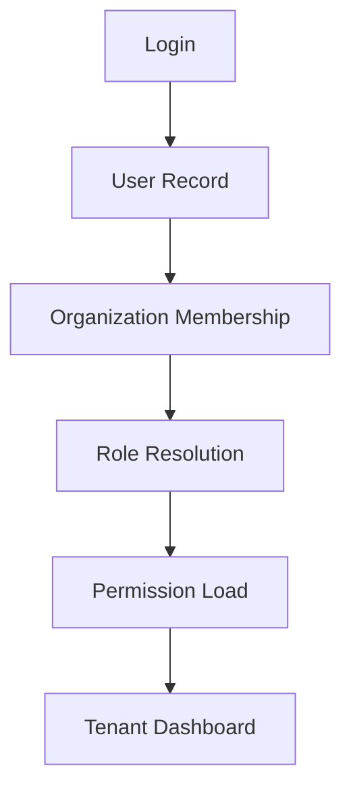

# Organization Model

Organizations are the tenant boundary for CompHelp AI.

## Organization Fields

- organization id
- company name
- owner user id
- status
- settings
- timezone
- demo mode flag

## Isolation Rules

- Every organization-scoped record must include `organization_id`.
- Cross-tenant access is never allowed by default.
- Future Supabase RLS must enforce organization isolation at the database level.
- API middleware should resolve organization before loading permissions.

## Flow

