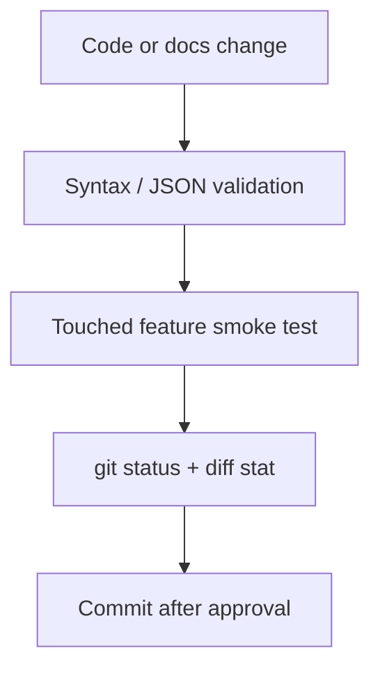

# Testing Strategy

## Goals

Testing must keep the app deployable, protect customer data, and prevent regressions in lead capture, dashboard workflows, APIs, and database fallback.

## Required Check

Run before commits:

```powershell
npm run check-project
```

## Current Validation Coverage

`scripts/check-project.js` validates:

- JavaScript syntax.
- JSON syntax.
- Required `package.json` scripts.
- Required Vercel rewrites.

## Manual Checks

For website changes:

- Homepage loads.
- Service pages load.
- Lead form remains usable.
- Chat widget remains usable.
- Mobile CTA remains usable.

For dashboard changes:

- Login works.
- Current role displays.
- Dashboard metrics render.
- Developer Center renders.
- Business Dashboard renders.

For API changes:

- Route returns JSON.
- Errors return safe JSON.
- Missing env vars do not crash fallback paths.

## Future Test Layers

- Unit tests for database methods.
- API smoke tests.
- Browser checks for dashboard flows.
- Security checks for secret exposure.
- Regression fixtures for JSON fallback data.

## Test Workflow



## Failure Policy

If validation fails, fix before moving to the next task. Do not commit broken code.

