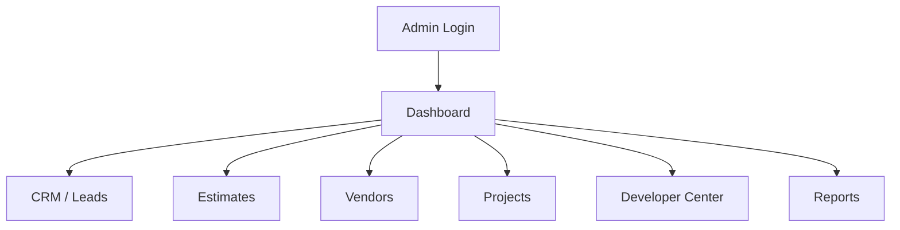

# UI Specification

## Design System

The current UI is a modern dark premium interface. Future changes must preserve layout, responsiveness, and visual tone unless a redesign is explicitly requested.

## Public Website

Public pages include:

- Homepage.
- Service pages.
- Local SEO pages.
- Gallery sections.
- Lead forms.
- Chat widgets.
- Call-to-action sections.

Public pages should prioritize fast loading, SEO, mobile responsiveness, clear CTAs, and trust.

## Marketplace Dashboard

Dashboard modules:

- Dashboard.
- Business Dashboard.
- Lead Manager.
- Lead Finder.
- Social Leads.
- Estimate Manager.
- Vendor Manager.
- Vendor Finder.
- Dispatcher.
- Quote Requests.
- AI Recommendations.
- Commissions.
- Follow-ups.
- SMS/Email Queue.
- Compliance.
- Analytics.
- Activity Logs.
- Deployment.
- Developer Center.
- Marketing.
- SEO Manager.
- SMM Manager.
- Projects.

## Developer Center

Developer Center must show:

- Repository Health.
- Validation Status.
- Git Status.
- Pending Changes.
- Deployment Status.
- Recent Commits.
- Build Status.
- Database Mode.
- Supabase Status.
- JSON Fallback Status.
- Last Database Check.
- Database Errors.
- Backup Status.
- API Status.

## Business Dashboard

Business Dashboard must show:

- Revenue.
- Leads.
- Pipeline.
- Projects.
- Open estimates.
- Pending jobs.
- Vendor performance.
- Profit.
- Tasks.
- Notifications.

## Accessibility

- Buttons need clear labels.
- Inputs need labels or placeholders.
- Keyboard navigation must remain usable.
- Focus states must remain visible.
- Important status messages must be text, not color only.

## Responsive Rules

The admin dashboard must be usable on mobile. Multi-column layouts collapse to one column below tablet width. Public landing pages should keep CTAs visible and readable.

## UI Flow

